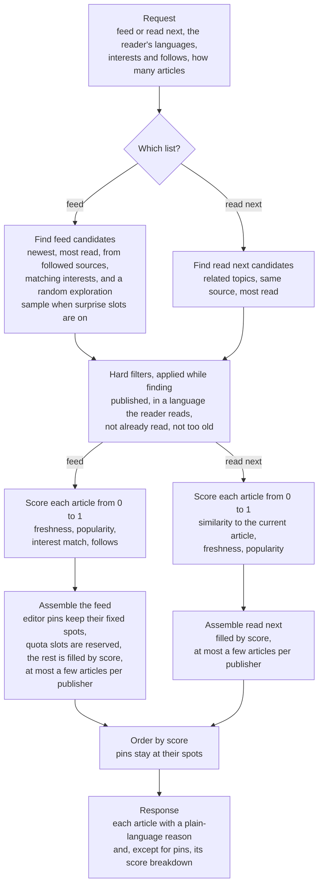

# How the recommender works

One engine serves two lists: the personalised **feed**, and **read next**, the
suggestions shown under an article someone is reading. Both go through the same
steps; where they differ, the diagram forks.

## The steps

1. **Request.** The caller says which list it wants and passes what the platform
   knows about the reader: languages, topics of interest, followed publishers and
   communities, and articles already read.
2. **Find candidates.** A few small, cheap lists of articles, merged into one.
   They decide which articles are considered at all, not their order. The feed
   looks at the newest articles, the most read, articles from followed publishers
   and communities, and articles matching the reader's interests. When surprise
   slots are switched on, it also takes a random sample of recent articles that
   match none of the reader's interests or follows. Read next looks at articles
   sharing topics with the current one, articles from the same publisher or
   community, and the most read.
3. **Hard filters.** Every list applies the same rules while it searches: only
   published articles, only in a language the reader reads, nothing already read,
   nothing older than a set age. Read next also leaves out the current article.
4. **Score.** Every candidate gets a score from 0 to 1 per criterion, and the final
   score is their weighted average. The weights are configuration: a weight of 0
   switches a criterion off.
5. **Assemble.** Editors can pin an article to a fixed spot in the feed. When
   quotas are switched on, a share of the feed is reserved: for topics the editors
   feature, for followed publishers and communities, and for surprise articles from
   the exploration sample. The remaining spots go to the best scores. While spots
   are filled, an article is skipped once its publisher already has the maximum
   number of spots. Read next has no pins and no quotas.
6. **Order.** The chosen articles are sorted by score; pinned articles stay at
   their spots.
7. **Response.** Each article comes with one or two plain-language reasons, such as
   "New" or "Matches your interest in climate", and every article except pinned ones
   also comes with its score per criterion, so every position can be explained. A
   pinned article's reason is the editor's note.

Settings such as weights, list sizes and quota shares live in
`config/default.json`; see the README. Quotas and surprise slots are off by
default.
